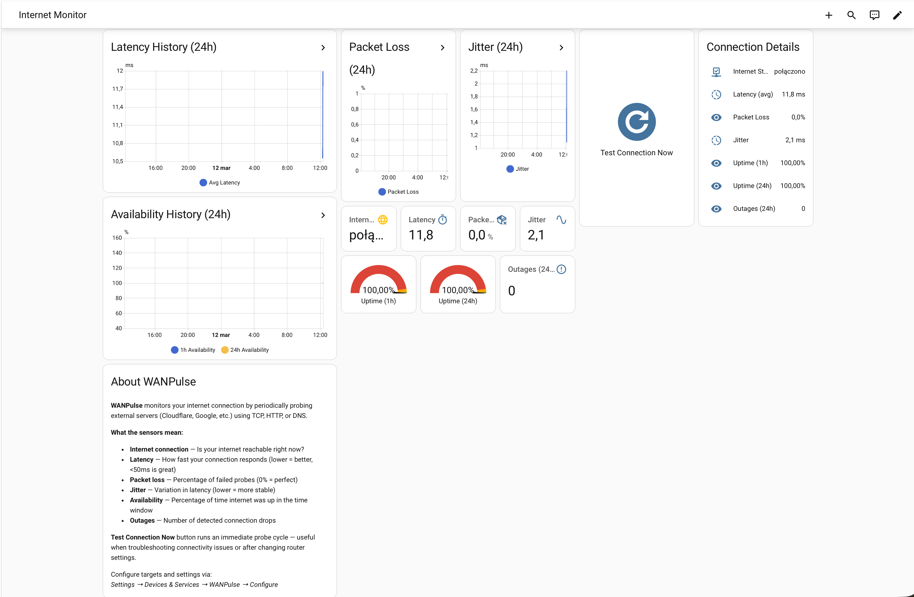
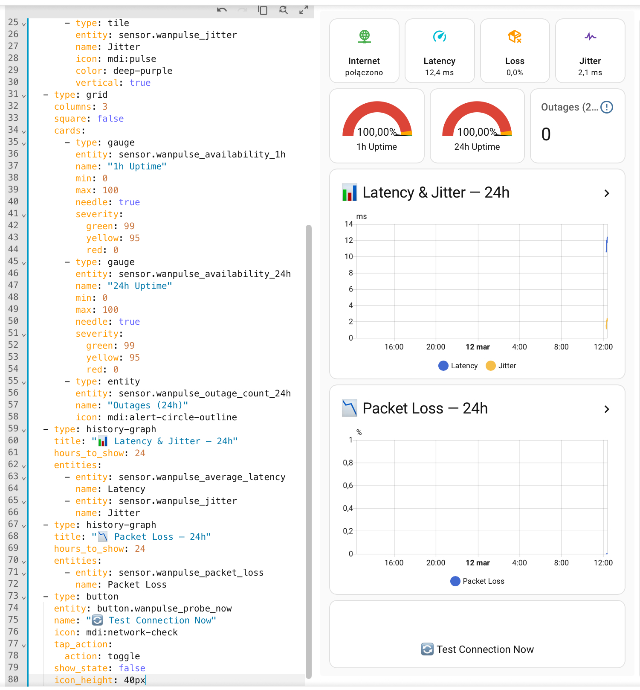

# WANPulse

<p align="center">
  
</p>

<p align="center">
  <strong>WAN/Internet Quality Monitor for Home Assistant</strong>
</p>

<p align="center">
  <a href="https://github.com/polprog-tech/WANPulse/actions/workflows/validate.yml"></a>
  <a href="https://github.com/polprog-tech/WANPulse/actions/workflows/ci.yml"></a>
  <a href="https://github.com/polprog-tech/WANPulse/releases"></a>
  <a href="https://github.com/polprog-tech/WANPulse/blob/main/LICENSE"></a>
  <a href="https://github.com/polprog-tech/WANPulse/stargazers"></a>
</p>

<p align="center">
  <a href="https://buymeacoffee.com/polprog"></a>
  <a href="https://github.com/sponsors/polprog-tech"></a>
</p>

---

**WANPulse** is a Home Assistant custom integration that answers a simple question: **"Is my internet actually working well right now?"**

It works like a heartbeat monitor for your internet connection. Every 60 seconds (configurable), it sends test probes to servers you choose (default: Cloudflare 1.1.1.1 and Google 8.8.8.8), measures response times, detects failures, and calculates real-time statistics — all **100% locally** on your Home Assistant instance.

- **Is my internet up or down?** — A simple binary sensor that's ON when your internet works
- **How fast is my connection?** — Latency in milliseconds (lower = better)
- **Am I losing packets?** — Packet loss percentage (0% = perfect)
- **Is my connection stable?** — Jitter measures variation in response times
- **What's my uptime?** — Availability percentages over 1 hour and 24 hours
- **How many outages happened?** — Count and total duration of detected drops

Unlike your router's basic "connected" status, WANPulse detects **micro-outages** (brief drops your ISP won't tell you about) and gives you **historical data** to spot patterns.

---

## Table of Contents

- [Key Features](#key-features)
- [Screenshots](#screenshots)
- [Installation](#installation)
- [Supported Home Assistant Versions](#supported-home-assistant-versions)
- [Supported Languages](#supported-languages)
- [Configuration Guide](#configuration-guide)
- [Entities Explained](#entities-explained)
- [Ready-Made Dashboard](#ready-made-dashboard)
- [Probe Methods](#probe-methods)
- [Example Automations](#example-automations)
- [Upgrading](#upgrading)
- [Troubleshooting](#troubleshooting)
- [FAQ](#faq)
- [Limitations & Known Tradeoffs](#limitations--known-tradeoffs)
- [Privacy & Security](#privacy--security)
- [Development](#development)
- [Author](#author)
- [Support the Project](#support-the-project)
- [License](#license)

---

## Key Features

- **Multiple probe targets** — Monitor several endpoints simultaneously
- **TCP / HTTP / DNS probe methods** — Choose the best method per target; TCP is the portable default
- **Real-time metrics** — Average/min/max latency, jitter, packet loss
- **Rolling availability** — 1-hour and 24-hour availability percentages
- **Outage detection** — Tracks consecutive failures, outage count, and total outage duration
- **Aggregate WAN health** — Single "WAN Status" binary sensor summarizing all targets
- **Manual probe button** — Trigger an immediate probe cycle from the UI
- **Fully async** — No blocking I/O; uses `asyncio` for all network operations
- **Zero external dependencies** — Uses `asyncio` and `aiohttp` (bundled with HA)
- **UI configuration** — Config flow, options flow, and reconfigure flow
- **Diagnostics support** — Safe diagnostics with sensitive data redaction
- **Repair issues** — Actionable repair issues for configuration problems
- **Multi-language** — Full English and Polish translations; easy to add more

## Screenshots

<p align="center">
  
</p>

<p align="center">
  
</p>

---

## Installation

### Via HACS (Recommended)

1. Open HACS in Home Assistant
2. Click the three dots menu > **Custom repositories**
3. Add `https://github.com/polprog-tech/WANPulse` as an **Integration**
4. Search for "WANPulse" and install
5. Restart Home Assistant

### Manual Installation

1. Download or clone this repository
2. Copy `custom_components/wanpulse/` to your Home Assistant `config/custom_components/` directory
3. Restart Home Assistant

---

## Supported Home Assistant Versions

**Minimum:** Home Assistant 2024.4.0

---

## Supported Languages

WANPulse is fully translated and adapts to your Home Assistant language setting.

| Language | Code | Status |
|----------|------|--------|
| 🇬🇧 English | `en` | ✅ Complete |
| 🇵🇱 Polish (Polski) | `pl` | ✅ Complete |

All UI elements are translated: config flow, options flow, entity names, error messages, and repair issues.

**Want to add your language?** Copy `custom_components/wanpulse/translations/en.json`, translate the values, save as `{language_code}.json`, and open a PR. See [CONTRIBUTING.md](CONTRIBUTING.md) for details.

---

## Configuration Guide

### Step 1: Add the Integration

1. Go to **Settings** > **Devices & Services** > **Add Integration**
2. Search for **WANPulse**
3. You'll see the setup form

### Step 2: Configure Probe Targets

In the **Probe targets** field, enter one target per line in this format:

```
host, label, method
```

Where:
- **host** — the IP address, hostname, or URL to probe
- **label** — a friendly name (shown in Home Assistant)
- **method** — `tcp` (recommended), `http`, or `dns`

**Default targets (good for most users):**
```
1.1.1.1, Cloudflare DNS, tcp
8.8.8.8, Google DNS, tcp
```

**More examples:**
```
1.1.1.1, Cloudflare DNS, tcp          # TCP probe to Cloudflare
8.8.8.8, Google DNS, tcp              # TCP probe to Google
https://www.google.com, Google, http  # HTTP probe to Google
www.google.com, Google DNS, dns       # DNS resolution test
9.9.9.9, Quad9, tcp                   # TCP probe to Quad9
208.67.222.222, OpenDNS, tcp          # TCP probe to OpenDNS
```

> **Tip:** Start with the defaults. They're reliable, globally available, and cover the most common use case — checking if your internet works.

### Step 3: Set Scan Interval

The **scan interval** controls how often WANPulse checks your connection. Default is **60 seconds**.

| Interval | Use case |
|----------|----------|
| 10–30s | Active troubleshooting, want to catch every micro-drop |
| 60s (default) | Good balance for daily monitoring |
| 120–300s | Low-traffic monitoring, running on limited hardware |

### Step 4: Fine-Tune Settings (Optional)

After setup, go to **Settings** > **Devices & Services** > **WANPulse** > **Configure** to adjust:

| Setting | Default | What it does |
|---------|---------|--------------|
| **Scan interval** | 60s | How often to probe. Lower = more responsive, more traffic |
| **Timeout** | 10s | Max time to wait for a probe response. Increase on slow connections |
| **Probes per cycle** | 3 | Number of probes sent per target per check. More = smoother averages |
| **Failure threshold** | 3 | Consecutive failed cycles before an outage is declared. Higher = fewer false alarms |

### Changing Targets After Setup

Go to **Settings** > **Devices & Services** > **WANPulse** > **three-dot menu** > **Reconfigure**.

---

## Entities Explained

WANPulse creates a single device called **WANPulse** with the following entities. Entity names are designed to be clear and self-explanatory.

### Internet Status (enabled by default)

| Entity | Type | What it shows |
|--------|------|---------------|
| **Internet connection** | Binary sensor | `ON` = internet is working (at least one target responds). `OFF` = all targets failed for several cycles |

### Internet Quality Metrics (enabled by default)

| Entity | Type | Unit | What it shows |
|--------|------|------|---------------|
| **Internet latency** | Sensor | ms | Average response time across all targets. <50ms = excellent, 50–100ms = good, >200ms = potential issue |
| **Internet packet loss** | Sensor | % | Percentage of probes that failed. 0% = perfect, >5% = connection issues |
| **Internet jitter** | Sensor | ms | Variation in latency between consecutive probes. Low = stable, high = unstable connection |
| **Availability last hour** | Sensor | % | What percentage of the last hour your internet was up. 100% = perfect |
| **Availability last 24 hours** | Sensor | % | Same but over 24 hours — shows long-term reliability |
| **Outages last 24 hours** | Sensor | count | Number of detected outage events in the last 24 hours |

### Advanced Metrics (disabled by default — enable in entity settings)

| Entity | Type | Unit | What it shows |
|--------|------|------|---------------|
| **Internet min latency** | Sensor | ms | Fastest response observed in current window |
| **Internet max latency** | Sensor | ms | Slowest response — spikes here indicate congestion |
| **Consecutive probe failures** | Sensor | count | Current failure streak. Diagnostic — helps debug false outages |
| **Total outage time (24h)** | Sensor | min | Total minutes your internet was down in the last 24 hours |

### Per-Target Metrics (disabled by default)

For each configured target (e.g., Cloudflare, Google), you get individual latency, packet loss, jitter, and availability sensors. These help you determine if a problem is **your internet** (all targets affected) or a **specific server** (only one target affected).

To enable per-target sensors: **Settings** > **Devices & Services** > **WANPulse** > **Entities** > click any disabled entity > **Enable**.

### Button

| Entity | What it does |
|--------|--------------|
| **Test connection now** | Immediately runs a probe cycle instead of waiting for the next scheduled check. Useful when troubleshooting — press this after rebooting your router or changing network settings to get instant results. |

---

## Ready-Made Dashboard

WANPulse comes with ready-to-use cards — you can set up a full dashboard or add individual cards to any existing dashboard.

### How to add a card (3 steps)

This works for **any** card below:

1. Open any dashboard → click the **pencil ✏️** icon (top right) to enter Edit mode
2. Click **"+ Add Card"** (bottom right) → scroll down → click **"Manual"**
3. Paste the YAML → click **"Save"**

That's it! The card appears on your dashboard immediately.

> **Tip:** If your entity IDs differ from the defaults, go to **Settings** > **Devices & Services** > **Entities** and search "wanpulse" to find yours.

### 🟢 Option A: All-in-One Card

One card with everything — status tiles, gauges, charts, and test button. Perfect for adding to your main dashboard.

Paste the contents of [`docs/cards/all-in-one.yaml`](docs/cards/all-in-one.yaml):

```yaml
type: vertical-stack
cards:
  - type: grid
    columns: 4
    square: false
    cards:
      - type: tile
        entity: binary_sensor.wanpulse_wan_status
        name: Internet
        icon: mdi:wan
        color: green
        vertical: true
      - type: tile
        entity: sensor.wanpulse_average_latency
        name: Latency
        icon: mdi:speedometer
        color: cyan
        vertical: true
      - type: tile
        entity: sensor.wanpulse_packet_loss
        name: Loss
        icon: mdi:package-variant-remove
        color: orange
        vertical: true
      - type: tile
        entity: sensor.wanpulse_jitter
        name: Jitter
        icon: mdi:pulse
        color: deep-purple
        vertical: true
  - type: grid
    columns: 3
    square: false
    cards:
      - type: gauge
        entity: sensor.wanpulse_availability_1h
        name: "1h Uptime"
        min: 0
        max: 100
        needle: true
        severity:
          green: 99
          yellow: 95
          red: 0
      - type: gauge
        entity: sensor.wanpulse_availability_24h
        name: "24h Uptime"
        min: 0
        max: 100
        needle: true
        severity:
          green: 99
          yellow: 95
          red: 0
      - type: entity
        entity: sensor.wanpulse_outage_count_24h
        name: "Outages (24h)"
        icon: mdi:alert-circle-outline
  - type: history-graph
    title: "📊 Latency & Jitter — 24h"
    hours_to_show: 24
    entities:
      - entity: sensor.wanpulse_average_latency
        name: Latency
      - entity: sensor.wanpulse_jitter
        name: Jitter
  - type: history-graph
    title: "📉 Packet Loss — 24h"
    hours_to_show: 24
    entities:
      - entity: sensor.wanpulse_packet_loss
        name: Packet Loss
  - type: button
    entity: button.wanpulse_probe_now
    name: "🔄 Test Connection Now"
    icon: mdi:network-check
    tap_action:
      action: toggle
    show_state: false
    icon_height: 40px
```

### 🧩 Option B: Individual Cards

Pick only the cards you need. Each file in [`docs/cards/`](docs/cards/) is a standalone card.

| Card | What it shows | File |
|------|---------------|------|
| **Status Overview** | 4 colored tiles: Internet, Latency, Packet Loss, Jitter | [`status-overview.yaml`](docs/cards/status-overview.yaml) |
| **Availability Gauges** | Two needle gauges with color coding (1h + 24h) | [`availability-gauges.yaml`](docs/cards/availability-gauges.yaml) |
| **Latency & Jitter Chart** | 24h history graph with both metrics combined | [`latency-jitter-chart.yaml`](docs/cards/latency-jitter-chart.yaml) |
| **Loss & Availability Charts** | Side-by-side packet loss and availability history | [`loss-availability-chart.yaml`](docs/cards/loss-availability-chart.yaml) |
| **Actions & Outages** | Test button + outage counter | [`actions-outages.yaml`](docs/cards/actions-outages.yaml) |
| **All-in-One** | Everything in a single card | [`all-in-one.yaml`](docs/cards/all-in-one.yaml) |

### 📋 Option C: Full Dedicated Dashboard

If you want a separate "Internet Monitor" dashboard with all cards pre-arranged:

1. Go to **Settings** > **Dashboards** > **Add Dashboard**
2. Name it "Internet Monitor" and create it
3. Open the new dashboard → **three-dot menu** (⋮) → **Edit Dashboard**
4. **Three-dot menu** (⋮) again → **Raw configuration editor**
5. Paste the contents of [`docs/dashboard.yaml`](docs/dashboard.yaml)
6. Click **Save**

### Advanced: ApexCharts (optional, requires HACS)

If you have [apexcharts-card](https://github.com/RomRider/apexcharts-card) installed via HACS, you can create richer charts:

```yaml
type: custom:apexcharts-card
header:
  title: Internet Latency & Jitter
  show: true
graph_span: 24h
span:
  end: now
series:
  - entity: sensor.wanpulse_average_latency
    name: Latency
    type: line
    stroke_width: 2
    color: "#4CAF50"
  - entity: sensor.wanpulse_jitter
    name: Jitter
    type: area
    stroke_width: 1
    color: "#FF9800"
    opacity: 0.3
```

> **Tip:** History charts use HA's recorder and persist across restarts. Real-time metrics (current latency, jitter) rebuild within 2–3 minutes after restart.

---

## Probe Methods

| Method | Target Format | What It Tests | Portability |
|--------|--------------|---------------|-------------|
| **TCP** (default) | IP or hostname | TCP connection to port 443 | Universal |
| **HTTP** | URL or hostname | HTTP HEAD response | Universal |
| **DNS** | Hostname | DNS resolution via system resolver | Universal |

### Why not ICMP/Ping?

ICMP raw sockets require elevated privileges that are not available on all Home Assistant installations (Container, HAOS sandboxed add-ons). TCP connect to port 443 is universally available and a reliable indicator of internet connectivity.

---

## Example Automations

### Notify on WAN Outage

```yaml
automation:
  - alias: "WANPulse - Internet Down"
    trigger:
      - platform: state
        entity_id: binary_sensor.wanpulse_wan_status
        to: "off"
        for:
          minutes: 2
    action:
      - service: notify.mobile_app
        data:
          title: "Internet Down"
          message: "WANPulse detected an internet outage."
```

### Notify on Recovery

```yaml
automation:
  - alias: "WANPulse - Internet Recovered"
    trigger:
      - platform: state
        entity_id: binary_sensor.wanpulse_wan_status
        from: "off"
        to: "on"
    action:
      - service: notify.mobile_app
        data:
          title: "Internet Restored"
          message: "Internet connectivity has been restored."
```

### Alert on High Latency

```yaml
automation:
  - alias: "WANPulse - High Latency"
    trigger:
      - platform: numeric_state
        entity_id: sensor.wanpulse_average_latency
        above: 200
        for:
          minutes: 5
    action:
      - service: notify.mobile_app
        data:
          title: "High Latency Detected"
          message: "Average WAN latency is above 200ms."
```

---

## Upgrading

### Via HACS

1. Open HACS in Home Assistant
2. Go to **Integrations** tab
3. Find WANPulse — if an update is available, click **Update**
4. Restart Home Assistant

### Manual Upgrade

1. Download the new release from [GitHub Releases](https://github.com/polprog-tech/WANPulse/releases)
2. Replace the `custom_components/wanpulse/` directory with the new version
3. **Delete** any `__pycache__` folders inside `custom_components/wanpulse/` (see [FAQ: Deleting `__pycache__`](#what-is-__pycache__-and-how-do-i-delete-it))
4. Restart Home Assistant

### Version Compatibility Notes

| From | To | Notes |
|------|----|-------|
| 1.0.x (old entity IDs) | 1.1.x+ | Entity IDs changed — see migration note below |
| 1.1.x | 1.x.x | No migration needed. Config entries are compatible. |

WANPulse uses config entry versioning. When a new version requires data migration, it happens automatically on startup. Your targets and settings are preserved.

### Entity ID migration (version 1.1.0+)

Starting from version 1.1.0, WANPulse uses **stable, language-independent entity IDs** based on internal keys instead of translated names. This means entity IDs are now the same regardless of your Home Assistant language setting.

**New entity IDs:**

| Entity | New ID (1.1.0+) |
|--------|-----------------|
| Internet connection | `binary_sensor.wanpulse_wan_status` |
| Internet latency | `sensor.wanpulse_average_latency` |
| Internet packet loss | `sensor.wanpulse_packet_loss` |
| Internet jitter | `sensor.wanpulse_jitter` |
| Availability (1h) | `sensor.wanpulse_availability_1h` |
| Availability (24h) | `sensor.wanpulse_availability_24h` |
| Outages (24h) | `sensor.wanpulse_outage_count_24h` |
| Test button | `button.wanpulse_probe_now` |

**If you upgraded from an earlier version** and your dashboard cards show "Entity not found":

1. Go to **Settings** > **Devices & Services** > **WANPulse** > **Delete**
2. **Restart** Home Assistant
3. **Re-add** WANPulse (Settings > Devices & Services > Add Integration > WANPulse)
4. Dashboard cards will now work with the new entity IDs

> **Note:** This re-registration resets rolling statistics but preserves your recorder history (graphs).

### What to expect after upgrading

- **Rolling window statistics** (current latency, availability) are **reset** on restart — they rebuild as new probes run
- **Historical data** in Home Assistant's recorder (graphs) is **preserved**
- **Entity IDs** are stable and language-independent from version 1.1.0+
- If new entities are added in an update, they appear as **disabled by default** to avoid clutter

### Downgrading

If you need to downgrade, simply replace the integration files with the older version and restart. Config entries from newer versions are generally backward-compatible within the same major version.

---

## Troubleshooting

| Problem | Solution |
|---------|----------|
| **"Invalid handler specified"** when adding integration | Delete `__pycache__` folders ([how?](#what-is-__pycache__-and-how-do-i-delete-it)), then restart HA completely |
| **"No valid targets configured"** repair issue | Reconfigure the integration with valid targets (Settings > Devices & Services > WANPulse > Reconfigure) |
| All targets showing offline | Check your internet connection; verify targets are reachable from your HA host. Try `ping 1.1.1.1` from the HA terminal |
| High packet loss reported | Increase timeout (Configure > Timeout); if your connection is slow, probes may time out |
| Entities not updating | Check scan interval; press "Test connection now" button for immediate results |
| Entity values are `unknown` after restart | This is normal — rolling window stats rebuild after the first probe cycle completes |
| Integration not appearing in search | Ensure `custom_components/wanpulse/` exists and has all files; check HA logs for import errors |

### Checking Logs

If something isn't working, check Home Assistant logs:

1. Go to **Settings** > **System** > **Logs**
2. Search for `wanpulse`
3. Look for ERROR or WARNING messages

You can also enable debug logging by adding this to `configuration.yaml`:

```yaml
logger:
  logs:
    custom_components.wanpulse: debug
```

---

## FAQ

<details>
<summary><strong>What is <code>__pycache__</code> and how do I delete it?</strong></summary>

Python caches compiled `.pyc` files in `__pycache__` folders. After updating WANPulse, **stale cached bytecode** can cause errors like "Invalid handler specified." Deleting `__pycache__` forces Python to recompile from the updated source.

The folder is **hidden by default** in most file managers. Here's how to find and delete it:

**Terminal / SSH (recommended):**
```bash
find /config/custom_components/wanpulse -type d -name __pycache__ -exec rm -rf {} +
```
> On HA Container or Core, replace `/config` with your config path (e.g. `~/.homeassistant`).

**macOS Finder:** Press **⌘ Cmd + Shift + .** to toggle hidden files. Delete `__pycache__`, then press the shortcut again.

**Windows Explorer:** Click **View** > **Hidden items** (Win 10) or **Show** > **Hidden items** (Win 11). Delete the folder.

**VS Code:** Open Settings (Ctrl/⌘ + ,), search `files.exclude`, uncheck the `**/__pycache__` pattern. Delete the folder, then re-enable.

**File Editor / Samba add-on:** `__pycache__` is usually already visible. Navigate to `config/custom_components/wanpulse/` and delete it.
</details>

<details>
<summary><strong>Dashboard cards show "Entity not found" — why?</strong></summary>

This happens when entity IDs in the card YAML don't match your actual entity IDs. Common causes:

1. **Upgraded from an older version** — Entity IDs were previously generated from translated entity names (which changed between versions). Since version 1.1.0, entity IDs use stable internal keys.

2. **Home Assistant is set to a non-English language** — Older versions generated entity IDs from the translated name, so Polish HA would create IDs like `sensor.wanpulse_opoznienie_internetu` instead of `sensor.wanpulse_average_latency`.

**Fix:** Delete and re-add the integration:
1. **Settings** > **Devices & Services** > **WANPulse** > ⋮ > **Delete**
2. **Restart** Home Assistant
3. **Re-add** WANPulse (Settings > Devices > Add Integration > WANPulse)

After re-adding, your entity IDs will match the dashboard YAML. Your recorder history (graphs) is preserved.

**To check your current entity IDs:** Settings > Devices & Services > WANPulse > click the device > see entity list with IDs.
</details>

<details>
<summary><strong>How do I clear all WANPulse data and start fresh?</strong></summary>

WANPulse stores data in two places:

1. **In-memory rolling statistics** (latency, availability, outage counters) — these reset automatically on every HA restart.

2. **Home Assistant recorder** (long-term history and graphs) — to clear this:
   1. Go to **Developer Tools** > **Statistics**
   2. Search for entities starting with `sensor.wanpulse_` or `binary_sensor.wanpulse_`
   3. Delete the statistics for the entities you want to reset

To completely start over:
1. Go to **Settings** > **Devices & Services** > **WANPulse**
2. Click the three dots (⋮) > **Delete**
3. Restart Home Assistant
4. Re-add WANPulse from scratch
</details>

<details>
<summary><strong>Why do my graphs/statistics disappear after restarting HA?</strong></summary>

**Short answer:** The real-time gauges (current latency, current availability, jitter) reset because they are calculated from an in-memory rolling window. This is by design — keeping hours of measurement data in memory is lightweight and fast.

**Your history charts are preserved.** The Home Assistant recorder saves every entity state change to a database. So the 24-hour or 7-day history graphs on your dashboard still have all historical data. Only the "current" real-time values need a few probe cycles to recalculate.

Typically within 2–3 minutes after restart, all values are populated again.
</details>

<details>
<summary><strong>Why is there no ICMP (ping) probe?</strong></summary>

ICMP raw sockets require elevated privileges (`CAP_NET_RAW`) that are **not available** in most Home Assistant installations (HA OS, Container). Instead of failing silently or requiring complex workarounds, WANPulse uses:

- **TCP connect** (default) — connects to port 443, works everywhere, similar reliability to ping
- **HTTP HEAD** — sends an HTTP request, can verify application-level connectivity
- **DNS resolution** — resolves a hostname, tests DNS infrastructure

TCP connect on port 443 is the best general-purpose substitute for ping and works on all HA installation types without privileges.
</details>

<details>
<summary><strong>Can I monitor more than 10 targets?</strong></summary>

The limit of 10 targets is intentional to prevent excessive network traffic and resource usage. For most users, 2–4 targets provide an accurate picture of internet health.

If you need more, you can edit the `MAX_TARGETS` constant in `custom_components/wanpulse/const.py`, but keep in mind that each target adds network requests every scan interval.
</details>

<details>
<summary><strong>Can I run multiple WANPulse instances?</strong></summary>

No, WANPulse is designed as a single-instance integration. One instance monitors all your targets. This keeps things simple and avoids duplicate entities. If you need to monitor different WAN connections (e.g., dual-WAN), add targets that route through each connection.
</details>

<details>
<summary><strong>What happens if one target fails but others succeed?</strong></summary>

WANPulse handles partial failures intelligently:

- **Per-target entities** show the exact status of each target (online/offline, latency, etc.)
- **The aggregate "Internet connection" sensor** stays ON as long as **at least one target** is reachable
- **Availability and packet loss** are calculated per-target and as an aggregate average

This means a single unreachable target won't falsely report your internet as down if other targets are responding normally.
</details>

<details>
<summary><strong>How much network traffic does WANPulse generate?</strong></summary>

Very little. With default settings (60-second interval, 3 probes per cycle, 2 targets):

- **TCP probe:** ~200 bytes per probe (SYN/SYN-ACK/RST) × 3 probes × 2 targets = ~1.2 KB/min
- **HTTP HEAD probe:** ~500 bytes per probe × 3 × 2 = ~3 KB/min
- **DNS probe:** ~100 bytes per probe × 3 × 2 = ~600 bytes/min

That's roughly **1–4 KB per minute**, or **1.5–6 MB per day** — negligible on any connection.
</details>

<details>
<summary><strong>How do I change the probe method for a specific target?</strong></summary>

When configuring targets (during setup or via Reconfigure), specify the method as the third parameter:

```
1.1.1.1, Cloudflare, tcp
8.8.8.8, Google DNS, dns
example.com, Web Check, http
```

If you omit the method, it uses the default set in the options (TCP by default).
</details>

<details>
<summary><strong>What does the "Test connection now" button do?</strong></summary>

It triggers an **immediate probe cycle** outside the regular schedule. Useful for:

- Checking if your connection recovered after an outage
- Testing after changing WANPulse configuration
- Quick verification without waiting for the next scheduled probe

The results are reflected in all sensors immediately, just like a scheduled probe.
</details>

<details>
<summary><strong>How do I reduce Home Assistant database growth from WANPulse?</strong></summary>

WANPulse entities update every probe cycle (default: 60 seconds). If you're concerned about database size:

1. **Increase scan interval** — Settings > Devices & Services > WANPulse > Configure > set to 120 or 300 seconds
2. **Exclude entities from recorder** — Add to `configuration.yaml`:

```yaml
recorder:
  exclude:
    entity_globs:
      - sensor.wanpulse_*_target_*   # Exclude per-target entities
```

3. **Keep aggregate entities** — The main sensors (internet connection, latency, availability) are the most useful for long-term history
4. **Set recorder purge** — HA automatically purges old data (default: 10 days). Adjust with `purge_keep_days` if needed.
</details>

<details>
<summary><strong>Can I use WANPulse with Home Assistant Energy Dashboard?</strong></summary>

No, WANPulse monitors network quality, not energy consumption. However, you can use WANPulse data in **automations** — for example, to pause large downloads or uploads when internet quality degrades.
</details>

<details>
<summary><strong>Why does availability show less than 100% even though my internet seems fine?</strong></summary>

Common reasons:

- **Probe timeout too low** — If your default timeout is 5 seconds but some probes take 6 seconds, they count as failed. Try increasing the timeout.
- **Target server was briefly unavailable** — Even reliable servers like 1.1.1.1 can have momentary blips. Using multiple targets smooths this out.
- **Wi-Fi interference** — If HA connects via Wi-Fi, local wireless issues can cause probe failures that aren't truly WAN problems.
- **After a restart** — Availability recalculates from scratch. Give it an hour to stabilize.
</details>

<details>
<summary><strong>How do I completely uninstall WANPulse?</strong></summary>

1. Go to **Settings** > **Devices & Services** > **WANPulse**
2. Click the three dots (⋮) > **Delete**
3. Restart Home Assistant
4. Delete the `custom_components/wanpulse/` directory
5. (Optional) Remove any WANPulse automations or dashboard cards you created
6. Restart Home Assistant once more

If installed via HACS, use HACS to remove it instead of manually deleting files.
</details>

---

## Limitations & Known Tradeoffs

- **Rolling window data is in-memory** — Statistics reset on HA restart. Historical data is preserved in the HA recorder for graphing.
- **System DNS resolver** — DNS probe uses the system resolver, not a specific DNS server.
- **No ICMP support** — By design, for portability. Use TCP probe as an equivalent.
- **Single config entry** — Only one WANPulse instance per HA installation.
- **Max 10 targets** — To prevent resource abuse.

---

## Privacy & Security

- **All processing is local** — No data is sent to external services beyond the configured probe targets.
- **Network activity** — WANPulse only connects to the targets you configure (TCP handshake, HTTP HEAD, or DNS resolution).
- **Diagnostics** — Target hosts and labels are redacted in diagnostic downloads.
- **No telemetry** — WANPulse does not collect or transmit usage data.

---

## Development

### Setup

```bash
git clone https://github.com/polprog-tech/WANPulse.git
cd WANPulse
python -m venv venv
source venv/bin/activate
pip install -r requirements_test.txt
```

### Running Tests

```bash
pytest tests/ -v --cov=custom_components/wanpulse
```

### Linting

```bash
pip install ruff
ruff check .
ruff format --check .
```

### Type Checking

```bash
pip install mypy
mypy custom_components/wanpulse --ignore-missing-imports
```

---

## Release Notes Policy

WANPulse follows semantic versioning. See [CHANGELOG.md](CHANGELOG.md) for release history.

---

## Author

Created and maintained by **POLPROG** ([@polprog-tech](https://github.com/polprog-tech)).

- **Report issues:** [GitHub Issues](https://github.com/polprog-tech/WANPulse/issues)
- **Feature requests:** [GitHub Discussions](https://github.com/polprog-tech/WANPulse/discussions)
- **Documentation:** [docs/architecture.md](docs/architecture.md)

## Support the Project

If WANPulse is useful to you, consider supporting its development:

[](https://buymeacoffee.com/polprog)
[](https://github.com/sponsors/polprog-tech)

You can also support by:
- Starring this repository
- Sharing WANPulse with others
- Reporting bugs and contributing fixes
- Contributing new features or documentation

---

## License

MIT License — see [LICENSE](LICENSE).
